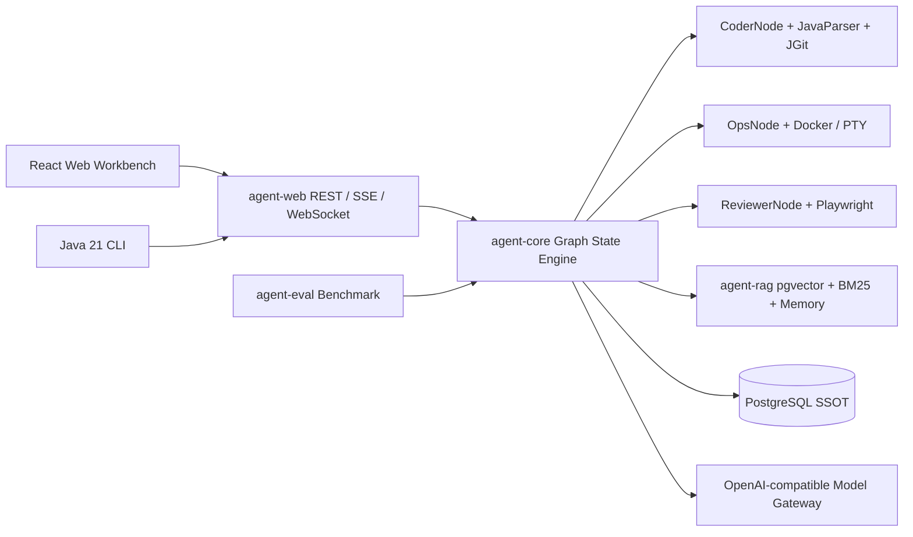

<div align="center">

# Agent4J

**一个基于 Java 21 虚拟线程与 Spring Boot 3.3 构建的纯自研、高并发、全自动 Code & GUI Agent 运行平台。**

[](https://www.oracle.com/java/technologies/javase/jdk21-archive-downloads.html)
[](https://spring.io/projects/spring-boot)
[](https://docs.docker.com/compose/)
[](#license)

自研 Graph State Engine · AST 增量修改 · Docker/PTY 沙箱 · Playwright 视觉审查 · PostgreSQL Checkpoint · Codebase RAG

</div>

<!--
Showcase: 将真实截图保存为 docs/assets/workbench-showcase.png 后，取消下一行注释。

-->

## Why Agent4J?

- 🚀 **去框架化纯自研引擎**：零依赖 LangChain4j/LangGraph4j，手写基于 Java 21 虚拟线程驱动的图状态机（`StateGraph`）。
- 🛠️ **B+C 体系双轮驱动**：JavaParser AST 符号索引与 Unified Diff 增量 Patch，配合 Docker-Java/pty4j 隔离执行代码和测试。
- 👁️ **GUI 视觉与模型智能路由**：Playwright 无头浏览器负责导航、DOM、截图和审查；Resilience4j 为多模型路由提供熔断和降级。
- 🛡️ **企业级 Harness**：PostgreSQL 作为唯一权威状态源（SSOT），支持 HITL 审批挂起/恢复、实时 Trace、终端日志和错误堆栈留痕。

## Quick Start: Docker

只需要 Docker Desktop。项目提供两套明确的 Compose 启动方式：本地开发调试使用已经编译好的 Jar，启动快；上线构建使用多阶段 Dockerfile，在容器内完成 Maven 和前端构建，更严格但耗时更长。两套方式都从 `.env` 注入配置。

### 本地开发调试（快速启动）

本地模式先在宿主机编译 `agent-web`，再由 `Dockerfile.local` 启动已生成的 Jar，并挂载 Docker Socket 供沙箱调用：

```powershell
if (!(Test-Path .env)) { Copy-Item .env.example .env }
mvn -pl agent-web -am package -DskipTests
docker compose -f docker-compose.local.yml --env-file .env up -d --build
```

`Copy-Item` 只在 `.env` 不存在时执行，避免覆盖已有模型密钥、数据库密码和工作区配置。首次启动后，数据库凭据会保存在 PostgreSQL 数据卷中；修改 `.env` 中的 `POSTGRES_USER` 或 `POSTGRES_PASSWORD` 不会自动修改已初始化的数据卷。

### Windows 桌面工作台

`agent-desktop` 是独立的 Electron 外壳，默认且只连接本机 `http://127.0.0.1:8080`。它不会替代 Docker 服务；先按上方本地模式确认 readiness 为 `UP`，再启动桌面端：

```powershell
Set-Location agent-desktop
npm ci
npm run dev
```

桌面端启动时仅接受 `GET /actuator/health/readiness` 返回 HTTP `200` 且 JSON `status` 精确为 `UP`。服务未就绪时只显示自动重试页，不开放 Agent 操作。

在“新建工作区 -> 导入本地文件夹”中，桌面端使用 Windows 原生目录选择器，主进程仅把普通文件安全归档为 ZIP，再上传既有 `POST /api/workspace-imports`。宿主绝对路径、符号链接和超出服务端导入限制的项目不会发送到服务端。

构建 Windows 安装包：

```powershell
Set-Location agent-desktop
npm run package
```

安装包写入 `agent-desktop/release/`。打包复用已经安装的 Electron 运行时；若 npm 首次下载 Electron 受网络限制，请先执行 `npm ci` 后重试。

两套 Compose 都会强制启用完整产品工作台，因此即使宿主直跑配置中的 `AGENT_PRODUCTION_ENABLED=false`，Docker 内仍会注册工作区、会话和 Agent 执行接口。

打开 <http://localhost:8080>，输入任务描述并点击 **运行 Agent**，即可观察 `Planner -> Coder -> Ops -> Reviewer` 链路。停止本地服务：

```powershell
docker compose -f docker-compose.local.yml --env-file .env down
```

### 日志与会话审计

Compose 将日志挂载到宿主机 `${AGENT_LOG_HOST_DIR:-./logs}`，所有显示时间固定为北京时间（`Asia/Shanghai`）：

- `logs/agent4j-current.log`：应用、模型、节点、工具与异常运行日志，按天归档并保留 30 天。
- `logs/audit/agent4j-audit-current.log`：JSON Lines 会话审计，记录会话创建/归档、轮次提交/启动/完成/失败，以及用户输入、Agent 最终回答、Run 标识和耗时；按天归档并保留 30 天。

审计链路不读取 HTTP 请求头，并会对当前模型 API Key、数据库密码、OTLP Authorization，以及正文中的 `Bearer`、`sk-` 和敏感键值格式替换为 `[REDACTED]`。生产环境仍应限制 `logs/audit/` 的读取权限，并根据数据合规要求调整留存策略。

### 上线构建（严谨启动）

上线模式使用根目录 `Dockerfile`，在构建容器中完成完整 Maven/前端打包，再启动最小运行镜像：

```powershell
docker compose -f docker-compose.yml --env-file .env up -d --build
```

停止上线服务：

```powershell
docker compose -f docker-compose.yml --env-file .env down
```

清理本地数据库卷（会删除 Compose 创建的运行数据）：

```powershell
docker compose -f docker-compose.yml --env-file .env down -v
```

### 接入 OpenAI 兼容模型

编辑 `.env`，启用模型网关并填写完整路由链：

```dotenv
AGENT_LLM_ENABLED=true
AGENT_LLM_BASE_URL=https://your-openai-compatible-gateway.example.com
AGENT_LLM_API_KEY=replace-me
AGENT_LLM_CHAT_COMPLETIONS_PATH=/v1/chat/completions
AGENT_LLM_CODE_MODEL=your-code-model
AGENT_LLM_VISION_MODEL=your-vision-model
AGENT_LLM_QUICK_CLASSIFICATION_MODEL=your-fast-model
AGENT_LLM_FALLBACK_MODEL=your-fallback-model
AGENT_LLM_MAX_CONCURRENT_REQUESTS=8
AGENT_LLM_MAX_REQUESTS_PER_MINUTE=120
AGENT_LLM_QUEUE_TIMEOUT=2s
AGENT_LLM_CODE_CAPABILITIES=CHAT_COMPLETIONS,STREAMING,TOOL_CALLING
AGENT_LLM_VISION_CAPABILITIES=CHAT_COMPLETIONS,STREAMING,VISION_INPUT
AGENT_LLM_QUICK_CLASSIFICATION_CAPABILITIES=CHAT_COMPLETIONS,STREAMING
AGENT_LLM_FALLBACK_CAPABILITIES=CHAT_COMPLETIONS,TOOL_CALLING
AGENT_LLM_CIRCUIT_BREAKER_FAILURE_RATE_THRESHOLD=100
AGENT_LLM_CIRCUIT_BREAKER_MINIMUM_NUMBER_OF_CALLS=2
AGENT_LLM_CIRCUIT_BREAKER_SLIDING_WINDOW_SIZE=2
AGENT_LLM_CIRCUIT_BREAKER_WAIT_DURATION_IN_OPEN_STATE=30s
AGENT_LLM_CIRCUIT_BREAKER_PERMITTED_NUMBER_OF_CALLS_IN_HALF_OPEN_STATE=1
```

应用启动时会严格校验 endpoint、API Key、路径和四个模型名；缺少任一配置会快速失败。`.env` 已被 `.gitignore` 排除，禁止提交真实密钥。

能力声明不会根据模型名称推断。模型端点在请求前按 `CHAT_COMPLETIONS`、`STREAMING`、`TOOL_CALLING` 和 `VISION_INPUT` 做强类型准入；并发、每分钟请求数和排队时限也是端点级预算。流式调用会记录 TTFT、chunk 数和消费者背压耗时。

每个模型端点都有独立熔断器。默认连续两次失败后进入 OPEN，OPEN 期间不再发送主端点 HTTP 请求并直接使用 fallback；30 秒后只允许一次 HALF_OPEN 探测。可通过上述 `AGENT_LLM_CIRCUIT_BREAKER_*` 变量调整阈值、窗口和探测策略。

### PostgreSQL 连接

Compose 默认使用 `pgvector/pgvector:pg16`，并由 `POSTGRES_DB`、`POSTGRES_USER`、`POSTGRES_PASSWORD` 控制数据库初始化。应用容器通过 `SPRING_DATASOURCE_*` 连接 Compose 内的 `postgres` 服务。

如果日志出现 `password authentication failed`、`role does not exist` 或 `must be owner of table`，说明 `.env` 与既有数据卷的初始化账号不一致。以下命令会从 Compose 的实际解析结果读取数据库、账号、密码和数据卷，并在保留数据的前提下修复登录凭据、public schema 以及现有表和序列的 owner：

```powershell
.\scripts\repair-local-postgres.ps1
```

脚本只创建或更新登录角色、补齐权限并转移 owner，不删除数据库、表或数据卷。健康检查会验证同一组账号密码后，`agent-web` 才会启动。

## Architecture



## Modules

| Module | What it does |
| --- | --- |
| [`agent-core`](agent-core) | Immutable `AgentState`, virtual-thread `StateGraph`, LLM client, `ModelRouter`, Planner/Coder/Ops/Reviewer nodes |
| [`agent-sandbox`](agent-sandbox) | JavaParser AST, JGit Diff, Docker-Java, pty4j and Playwright Java |
| [`agent-rag`](agent-rag) | Parent/Child code chunking, pgvector + BM25 hybrid retrieval and `MemoryManager` |
| [`agent-web`](agent-web) | Spring WebFlux REST gateway, SSE/WebSocket streams, PostgreSQL Harness and React workbench |
| [`agent-eval`](agent-eval) | 58-task JSONL benchmark, bounded virtual-thread runner, `pass^k` and TTFT reports |
| [`agent-cli`](agent-cli) | Java 21 interactive client, persisted sessions, live SSE Trace/logs and Compose workspace launcher |

## What you can build

1. **Code agents** that inspect Java symbols, apply a bounded diff, run tests in an isolated workspace and preserve every failure stack trace.
2. **Operations agents** that execute Bash asynchronously, stream ANSI output to xterm.js and clean up timed-out Docker containers.
3. **Visual reviewers** that navigate a page, capture DOM/PNG evidence and route vision tasks through a dedicated model chain.
4. **Human-governed workflows** that pause before risky nodes, persist the checkpoint, accept an approval decision and resume from the exact node.
5. **Codebase-aware planners** that combine AST symbols, lexical BM25, vector similarity and scoped long-term memories.

## API surface

The Web gateway exposes a small, strict protocol:

```text
POST /api/runs                         Create a Run (202 Accepted)
GET  /api/runs/{runId}                 Read the latest checkpoint
GET  /api/runs/{runId}/history         Read checkpoint history
POST /api/runs/{runId}/approval        Approve or reject a waiting Run
GET  /api/runs/{runId}/logs            Terminal snapshot + live SSE logs
ws://host/ws/runs/{runId}/trace       Trace snapshot + ordered events
ws://host/ws/runs/{runId}/terminal    Terminal snapshot + ANSI log frames
```

Create a Run with the exact state shape:

```json
{
  "graphId": "sample",
  "initialState": {
    "messages": [],
    "variables": {},
    "trace": []
  }
}
```

Production graph IDs are the exact names of registered `GraphFactory` beans. Docker Compose enables
the production `code-agent` graph by default. The deterministic `demo-agent` graph remains
available for protocol debugging; the task-first endpoint is POST /api/runs/code-agent.

### Persistent conversations

The web workbench is conversation-first. On first load it resolves the configured identity, lists
the workspaces that identity can access, and restores `conversationId` from the URL. A conversation
belongs to exactly one workspace; its turns and the associated Run checkpoints are persisted in
PostgreSQL, so a browser refresh or a later visit does not discard context.

Use the sidebar to select a workspace, search or archive a conversation, and create a new one. Send
the first message from the composer; every later message is submitted to the same conversation and
the Planner receives the bounded completed-turn history. The response stays linked to its Run, so
Trace, ANSI terminal output, Diff, Reviewer evidence and HITL approval remain available beside the
chat. The browser never sends `userId`; identity and workspace permission come from the server.

Conversation endpoints:

```text
GET  /api/identity
GET  /api/workspaces
POST /api/workspaces
GET  /api/workspaces/{workspaceId}/conversations?query=...
POST /api/workspaces/{workspaceId}/conversations
GET  /api/conversations/{conversationId}
GET  /api/conversations/{conversationId}/turns
POST /api/conversations/{conversationId}/turns
POST /api/conversations/{conversationId}/archive
```

The service rejects cross-workspace access, disabled users, archived conversation writes and
concurrent active turns. PostgreSQL is the source of truth; WebSocket and SSE streams are delivery
channels only.

### Web 项目接入

工作区侧栏的文件夹按钮提供两种项目接入方式：

- **选择已挂载项目**：浏览 `/agent-workspace` 下的目录并注册工作区。文件不会复制，Agent 直接在
  当前 Compose bind mount 中工作。
- **导入本地文件夹**：浏览器通过 `webkitdirectory` 选择本地文件夹，前端生成 ZIP 并上传到
  `/agent-workspace/.agent4j/imports/<workspaceId>`。服务端会拒绝绝对路径、`..` 越界、重复规范化路径，
  并限制归档大小、解压大小和文件数；数据库注册失败时会删除已发布目录。

对应接口：

```text
GET  /api/workspace-directories?path=/agent-workspace
POST /api/workspace-imports    multipart: displayName, repositoryId, archive
```

外部项目需要零复制挂载时，使用 CLI 启动参数重新声明宿主目录，再在 Web 中选择挂载后的路径：

```powershell
.\agent4j.ps1 serve --workspace D:\projects\my-service
```

Web 不能在运行中修改 Docker bind mount；这样可以避免重启服务时中断当前会话、SSE 和 Agent Run。

### CLI and mounted workspaces

The CLI and Web workbench use the same REST/SSE protocol and PostgreSQL conversations. Build the
application and CLI with Java 21, then bind the repository you want Agent4J to edit:

```powershell
$env:JAVA_HOME='C:\Program Files\Java\jdk-21'
$env:Path="$env:JAVA_HOME\bin;$env:Path"
if (!(Test-Path .env)) { Copy-Item .env.example .env }
mvn -pl agent-web -am package -DskipTests
mvn -pl agent-cli package -DskipTests
.\agent4j.ps1 serve --workspace D:\projects\my-service --compose-file .\docker-compose.local.yml
```

`serve` validates the real host directory, passes it as `AGENT_CODE_HOST_WORKSPACE`, starts the
existing local Compose stack and waits for readiness. Compose exposes that one host directory to
the application as `/agent-workspace`; neither the CLI nor Web invents a second workspace mapping.
Readiness requires an Agent4J JSON response whose `status` field is exactly `UP`. On Windows, the CLI probes
`http://[::1]:8080`, then `http://127.0.0.1:8080`, so another local service bound to IPv4 port 8080
cannot make the Agent appear ready or add a 30-second DNS stall.

Start an interactive session or list persisted conversations:

```powershell
.\agent4j.ps1 chat --workspace D:\projects\my-service --server http://localhost:8080
.\agent4j.ps1 conversations --server http://localhost:8080
```

The `--server` option defaults to `http://localhost:8080`; the CLI transparently pins the first
working loopback endpoint after the identity request. The interactive client supports `/new`,
`/sessions`, `/use <conversationId>`, `/status` and
`/exit`. Normal messages create persisted Turns, while Trace summaries and PTY output arrive over
two live SSE streams. The CLI does not print `.env`, model keys, passwords, Authorization values
or process environment data.

In the Web sidebar, the folder-plus button creates a workspace with the exact server-visible path,
for example `/agent-workspace/service-a`. The path must already exist under the mounted root. A
browser cannot bind an arbitrary host directory; use `agent4j serve --workspace <host-path>` to
change the host mount. The active `workspaceId` and `conversationId` remain in the URL, so refreshes
restore the same project and conversation.

## Configuration

[`.env.example`](.env.example) is the safe, committed template. Copy it to `.env` for local Compose use. The application currently binds these groups:

| Group | Variables | Default |
| --- | --- | --- |
| Database | `POSTGRES_DB`, `POSTGRES_USER`, `POSTGRES_PASSWORD` | Compose-local values |
| Demo graph | `AGENT_SAMPLE_ENABLED` | `true` |
| Model gateway | `AGENT_LLM_ENABLED`, `AGENT_LLM_BASE_URL`, `AGENT_LLM_API_KEY`, `AGENT_LLM_*_MODEL`, `AGENT_LLM_*_CAPABILITIES`, `AGENT_LLM_MAX_CONCURRENT_REQUESTS`, `AGENT_LLM_MAX_REQUESTS_PER_MINUTE`, `AGENT_LLM_QUEUE_TIMEOUT`, `AGENT_LLM_CIRCUIT_BREAKER_*` | disabled |
| Observability | `AGENT_OBSERVABILITY_ENABLED`, `AGENT_OBSERVABILITY_OTLP_TRACES_ENDPOINT`, `AGENT_OBSERVABILITY_AUTHORIZATION` | disabled |

The model layer remains framework-independent: `ModelRouter` accepts endpoint chains through constructor injection, while `agent-web` supplies an optional environment-backed adapter. Each endpoint exposes a portable OpenAI-compatible service contract and independent admission budget. This keeps `agent-core` testable and makes the Docker deployment configurable without hard-coding vendor credentials.

## Development

Requirements: JDK 21, Maven 3.8.8+, Docker Desktop for integration tests. Node/npm is installed by `agent-web`'s Maven plugin (Node 22.22.2, npm 10.9.2).

```powershell
$env:JAVA_HOME='C:\Program Files\Java\jdk-21'
$env:Path="$env:JAVA_HOME\bin;$env:Path"
mvn clean verify
```

The full build runs Java tests, the frontend build, Vitest, and real Docker/PTY/Chromium/PostgreSQL/pgvector integration tests when those services are available.

<details>
<summary>Real LLM black-box acceptance</summary>

With Docker Compose running and `AGENT_LLM_ENABLED=true` configured in the ignored `.env`, run the
imported-project repair gate first, then the persisted two-turn conversation gate:

```powershell
pwsh .agent4j/acceptance/run-real-agent.ps1
pwsh .agent4j/acceptance/run-conversation-continuity.ps1
pwsh .agent4j/acceptance/run-live-llm-edd.ps1
```

The first command imports a failing Maven project and requires the Agent to modify it and pass its
test. The second command creates one Conversation with two independent Runs and requires the second
answer to retain exact facts from the first turn. The third command explicitly loads the required
LLM variables from `.env` into its own process, runs the tagged EDD suite, and requires a
`live-openai-compatible` report with at least one model request. Generated responses, Run snapshots and IDs are
written under the ignored `.agent4j/acceptance/evidence/` directory; neither command prints or commits
the API key.

</details>

<details>
<summary>Frontend-only checks</summary>

```powershell
Set-Location agent-web/src/main/frontend
.\.frontend\node\npm.cmd run test:run
.\.frontend\node\npm.cmd audit --audit-level=low
```

</details>

<details>
<summary>Run the application outside Docker</summary>

```powershell
$env:JAVA_HOME='C:\Program Files\Java\jdk-21'
$env:Path="$env:JAVA_HOME\bin;$env:Path"
mvn -pl agent-web -am spring-boot:run
```

Provide PostgreSQL through standard `SPRING_DATASOURCE_URL`, `SPRING_DATASOURCE_USERNAME` and `SPRING_DATASOURCE_PASSWORD` properties. For a repeatable local setup, prefer the Compose flow above.

</details>

## Documentation

- [Design blueprint and project rules](AGENTS.md)
- [Engineering pitfalls and interview guide](docs/ENGINEERING_PITFALLS.md)
- [Phase design specifications](docs/superpowers/specs/)
- [Phase implementation plans](docs/superpowers/plans/)

## Security notes

- Docker targets bind only the declared workspace and force-remove managed containers on success, failure or timeout.
- Unified Diff application rejects paths outside the repository root and preserves the original file on conflict.
- PTY execution receives an explicit Bash path and working directory; backend selection is type-safe.
- Do not commit `.env`, API keys, database passwords, certificates or generated `target/` / `node_modules/` content.

## Production Agent Runtime Notes

Docker Compose enables the production code-agent graph by default. The browser workbench submits
natural-language tasks to POST /api/runs/code-agent and displays Planner, Coder, Ops, Reviewer
evidence, Diff, terminal output, review decisions, Trace and complete error stacks.

Example request:

    {"task":"将 greeting.txt 修改为 hello agent4j，并运行 README 中的验证命令"}

Set AGENT_CODE_HOST_WORKSPACE to an existing Git worktree. Compose mounts that exact directory
at /agent-workspace; the one-shot sandbox receives only that workspace bind.

AGENT_LLM_BASE_URL is the gateway root. With
AGENT_LLM_CHAT_COMPLETIONS_PATH=/v1/chat/completions, do not include /v1 again in the base URL.

## License

This repository currently has **no declared open-source license**. Until a `LICENSE` file is published, all rights remain with the project owner and reuse should be requested explicitly.
