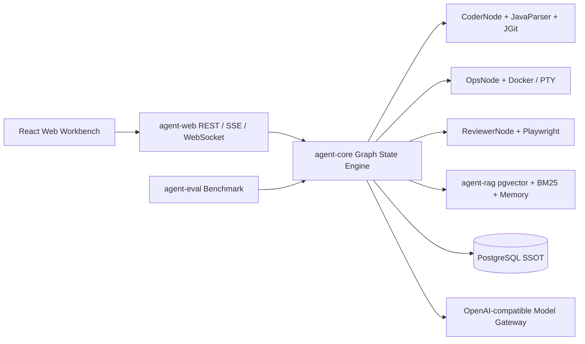

<div align="center">

# Agent4J

**一个基于 Java 21 虚拟线程与 Spring Boot 3.3 构建的纯自研、高并发、全自动 Code & GUI Agent 运行平台。**

[](https://www.oracle.com/java/technologies/javase/jdk21-archive-downloads.html)
[](https://spring.io/projects/spring-boot)
[](https://docs.docker.com/compose/)
[](#license)

自研 Graph State Engine · AST 增量修改 · Docker/PTY 沙箱 · Playwright 视觉审查 · PostgreSQL Checkpoint · Codebase RAG

</div>

<!--
Showcase: 将真实截图保存为 docs/assets/workbench-showcase.png 后，取消下一行注释。

-->

## Why Agent4J?

- 🚀 **去框架化纯自研引擎**：零依赖 LangChain4j/LangGraph4j，手写基于 Java 21 虚拟线程驱动的图状态机（`StateGraph`）。
- 🛠️ **B+C 体系双轮驱动**：JavaParser AST 符号索引与 Unified Diff 增量 Patch，配合 Docker-Java/pty4j 隔离执行代码和测试。
- 👁️ **GUI 视觉与模型智能路由**：Playwright 无头浏览器负责导航、DOM、截图和审查；Resilience4j 为多模型路由提供熔断和降级。
- 🛡️ **企业级 Harness**：PostgreSQL 作为唯一权威状态源（SSOT），支持 HITL 审批挂起/恢复、实时 Trace、终端日志和错误堆栈留痕。

## Quick Start: Docker

只需要 Docker Desktop。数据库、pgvector 和 Web 工作台由 Compose 一起启动，参数统一从 `.env` 注入。

```powershell
Copy-Item .env.example .env
docker compose --env-file .env up --build
```

打开 <http://localhost:8080>，在 **图 ID** 中输入 `sample`，提交默认状态即可验证 REST、Checkpoint、Trace 和工作台连接。`sample` 图是确定性演示图，不会替代真实 Coder/Ops/Reviewer 图的代码修改、沙箱执行或终端日志。停止服务：

```powershell
docker compose --env-file .env down
```

清理本地数据库卷（会删除 Compose 创建的运行数据）：

```powershell
docker compose --env-file .env down -v
```

### 接入 OpenAI 兼容模型

编辑 `.env`，启用模型网关并填写完整路由链：

```dotenv
AGENT_LLM_ENABLED=true
AGENT_LLM_BASE_URL=https://your-openai-compatible-gateway.example.com
AGENT_LLM_API_KEY=replace-me
AGENT_LLM_CHAT_COMPLETIONS_PATH=/v1/chat/completions
AGENT_LLM_CODE_MODEL=your-code-model
AGENT_LLM_VISION_MODEL=your-vision-model
AGENT_LLM_QUICK_CLASSIFICATION_MODEL=your-fast-model
AGENT_LLM_FALLBACK_MODEL=your-fallback-model
```

应用启动时会严格校验 endpoint、API Key、路径和四个模型名；缺少任一配置会快速失败。`.env` 已被 `.gitignore` 排除，禁止提交真实密钥。

### PostgreSQL 连接

Compose 默认使用 `pgvector/pgvector:pg16`，并由 `POSTGRES_DB`、`POSTGRES_USER`、`POSTGRES_PASSWORD` 控制数据库初始化。应用容器通过 `SPRING_DATASOURCE_*` 连接 Compose 内的 `postgres` 服务。

## Architecture



## Modules

| Module | What it does |
| --- | --- |
| [`agent-core`](agent-core) | Immutable `AgentState`, virtual-thread `StateGraph`, LLM client, `ModelRouter`, Planner/Coder/Ops/Reviewer nodes |
| [`agent-sandbox`](agent-sandbox) | JavaParser AST, JGit Diff, Docker-Java, pty4j and Playwright Java |
| [`agent-rag`](agent-rag) | Parent/Child code chunking, pgvector + BM25 hybrid retrieval and `MemoryManager` |
| [`agent-web`](agent-web) | Spring WebFlux REST gateway, SSE/WebSocket streams, PostgreSQL Harness and React workbench |
| [`agent-eval`](agent-eval) | 58-task JSONL benchmark, bounded virtual-thread runner, `pass^k` and TTFT reports |

## What you can build

1. **Code agents** that inspect Java symbols, apply a bounded diff, run tests in an isolated workspace and preserve every failure stack trace.
2. **Operations agents** that execute Bash asynchronously, stream ANSI output to xterm.js and clean up timed-out Docker containers.
3. **Visual reviewers** that navigate a page, capture DOM/PNG evidence and route vision tasks through a dedicated model chain.
4. **Human-governed workflows** that pause before risky nodes, persist the checkpoint, accept an approval decision and resume from the exact node.
5. **Codebase-aware planners** that combine AST symbols, lexical BM25, vector similarity and scoped long-term memories.

## API surface

The Web gateway exposes a small, strict protocol:

```text
POST /api/runs                         Create a Run (202 Accepted)
GET  /api/runs/{runId}                 Read the latest checkpoint
GET  /api/runs/{runId}/history         Read checkpoint history
POST /api/runs/{runId}/approval        Approve or reject a waiting Run
GET  /api/runs/{runId}/logs            Terminal snapshot + live SSE logs
ws://host/ws/runs/{runId}/trace       Trace snapshot + ordered events
ws://host/ws/runs/{runId}/terminal    Terminal snapshot + ANSI log frames
```

Create a Run with the exact state shape:

```json
{
  "graphId": "sample",
  "initialState": {
    "messages": [],
    "variables": {},
    "trace": []
  }
}
```

Production graph IDs are the exact names of registered `GraphFactory` beans. The Docker quick start registers only the deterministic `sample` graph; real Coder/Ops/Reviewer graphs are assembled by the host application with constructor-injected capabilities.

## Configuration

[`.env.example`](.env.example) is the safe, committed template. Copy it to `.env` for local Compose use. The application currently binds these groups:

| Group | Variables | Default |
| --- | --- | --- |
| Database | `POSTGRES_DB`, `POSTGRES_USER`, `POSTGRES_PASSWORD` | Compose-local values |
| Demo graph | `AGENT_SAMPLE_ENABLED` | `true` |
| Model gateway | `AGENT_LLM_ENABLED`, `AGENT_LLM_BASE_URL`, `AGENT_LLM_API_KEY`, `AGENT_LLM_*_MODEL` | disabled |
| Observability | `AGENT_OBSERVABILITY_ENABLED`, `AGENT_OBSERVABILITY_OTLP_TRACES_ENDPOINT`, `AGENT_OBSERVABILITY_AUTHORIZATION` | disabled |

The model layer remains framework-independent: `ModelRouter` accepts endpoint chains through constructor injection, while `agent-web` supplies an optional environment-backed adapter. This keeps `agent-core` testable and makes the Docker deployment configurable without hard-coding vendor credentials.

## Development

Requirements: JDK 21, Maven 3.8.8+, Docker Desktop for integration tests. Node/npm is installed by `agent-web`'s Maven plugin (Node 22.22.2, npm 10.9.2).

```powershell
$env:JAVA_HOME='C:\Program Files\Java\jdk-21'
$env:Path="$env:JAVA_HOME\bin;$env:Path"
mvn clean verify
```

The full build runs Java tests, the frontend build, Vitest, and real Docker/PTY/Chromium/PostgreSQL/pgvector integration tests when those services are available.

<details>
<summary>Frontend-only checks</summary>

```powershell
Set-Location agent-web/src/main/frontend
.\.frontend\node\npm.cmd run test:run
.\.frontend\node\npm.cmd audit --audit-level=low
```

</details>

<details>
<summary>Run the application outside Docker</summary>

```powershell
$env:JAVA_HOME='C:\Program Files\Java\jdk-21'
$env:Path="$env:JAVA_HOME\bin;$env:Path"
mvn -pl agent-web -am spring-boot:run
```

Provide PostgreSQL through standard `SPRING_DATASOURCE_URL`, `SPRING_DATASOURCE_USERNAME` and `SPRING_DATASOURCE_PASSWORD` properties. For a repeatable local setup, prefer the Compose flow above.

</details>

## Documentation

- [Design blueprint and project rules](AGENTS.md)
- [Engineering pitfalls and interview guide](docs/ENGINEERING_PITFALLS.md)
- [Phase design specifications](docs/superpowers/specs/)
- [Phase implementation plans](docs/superpowers/plans/)

## Security notes

- Docker targets bind only the declared workspace and force-remove managed containers on success, failure or timeout.
- Unified Diff application rejects paths outside the repository root and preserves the original file on conflict.
- PTY execution receives an explicit Bash path and working directory; backend selection is type-safe.
- Do not commit `.env`, API keys, database passwords, certificates or generated `target/` / `node_modules/` content.

## License

This repository currently has **no declared open-source license**. Until a `LICENSE` file is published, all rights remain with the project owner and reuse should be requested explicitly.
