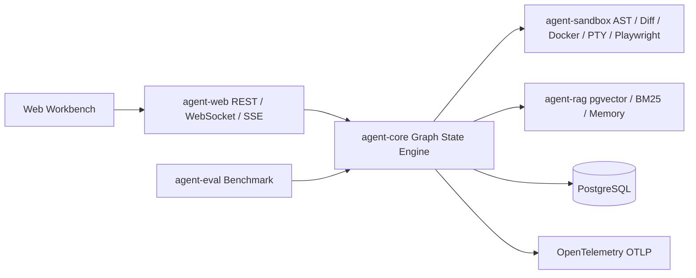

# Agent Runtime System

基于 Java 21 与 Spring Boot 3.3.13 的企业级 Agent 运行平台。项目不依赖 LangChain4j 或 LangGraph4j，核心是自研 Graph State Engine，并把代码修改、沙箱执行、浏览器自动化、持久化、人机审批、RAG、可观测性和 Benchmark 组合成一条可验证的 Agent 运行链。

> 当前仓库定位为可测试的工程基座与参考实现。`agent-web` 不内置生产图定义，启动前需要由调用方注册至少一个 `GraphFactory` Bean。

## 能力概览

- 不可变 `AgentState`、节点调度、条件路由、最大步数保护和 Java 21 虚拟线程。
- OpenAI 兼容格式的 `LlmClient`，支持 SSE 流式响应、工具调用和异常保留。
- `ModelRouter` 按 `TaskType` 路由模型，并通过 Resilience4j 执行有序降级与熔断。
- JavaParser AST 符号提取与 JGit Unified Diff 增量应用。
- Docker-Java 隔离 Bash、pty4j 本地 Bash、ANSI 日志捕获、超时终止与资源清理。
- Playwright Java 的导航、点击、DOM 提取和截图，浏览器操作绑定专属虚拟线程。
- PostgreSQL Checkpoint、HITL 审批挂起/恢复、Trace 与终端实时推送。
- Parent/Child Codebase RAG、pgvector、BM25、AST 符号检索和 `MemoryManager` 长期记忆。
- React/Vite Web Workbench：Monaco Diff、xterm.js 终端、审批弹窗和视觉证据画廊。
- 58 条 JSONL Benchmark 任务，输出 `pass^k` 稳定性和 TTFT 统计。

## 架构



## 模块

| 模块 | 职责 | 主要入口 |
| --- | --- | --- |
| `agent-core` | 状态、图、节点、LLM 客户端、模型路由、Trace 协议 | `com.agent.core.engine`、`com.agent.core.nodes`、`com.agent.core.llm` |
| `agent-sandbox` | JavaParser、JGit、Docker-Java、pty4j、Playwright | `com.agent.sandbox.ast`、`com.agent.sandbox.pty`、`com.agent.sandbox.browser` |
| `agent-rag` | 代码切片、pgvector 存储、混合检索、长期记忆 | `com.agent.rag.ingest`、`com.agent.rag.search`、`com.agent.rag.memory` |
| `agent-web` | Spring WebFlux 网关、PostgreSQL Harness、Web 工作台 | `com.agent.web.AgentWebApplication` |
| `agent-eval` | Benchmark 任务读取、并发运行、报告和 AgentRun 适配器 | `com.agent.eval` |

## 技术栈

- Java `21`、Spring Boot `3.3.13`、Maven 多模块工程
- JavaParser `3.28.2`、JGit `7.7.1.202607240634-r`
- Docker-Java `3.7.1`、pty4j `0.13.12`、Playwright Java `1.61.0`
- Resilience4j `2.4.0`、OpenTelemetry `1.64.0`
- PostgreSQL、`pgvector`、Flyway
- React `19.2.8`、Vite `8.2.0`、TypeScript `7.0.2`
- Monaco Editor、xterm.js、Vitest

## 环境要求

必需：

- JDK `21`，并确保 `java -version` 与 `mvn -version` 使用同一个 JDK。
- Maven `3.8.8` 或更高版本。
- Node/npm 无需全局安装；`agent-web` 的 Maven 插件会安装 Node `22.22.2` 与 npm `10.9.2` 到被忽略的 `.frontend/` 目录。

按测试或能力启用：

- Docker Engine：执行 Docker Bash 与 Testcontainers 集成测试。
- Git Bash：执行本地 pty4j 集成测试。
- Chromium：执行 Playwright 集成测试。
- PostgreSQL：运行 `agent-web` 的真实 Checkpoint 持久化；RAG/Memory 集成测试会显式加载各自的 SQL 迁移。
- `pgvector`：RAG 与 Memory 的数据库集成测试使用 `pgvector/pgvector:pg16`。

## 快速开始

### 验证完整工程

在仓库根目录执行：

```powershell
$env:JAVA_HOME='C:\Program Files\Java\jdk-21'
$env:Path="$env:JAVA_HOME\bin;$env:Path"
mvn clean verify
```

该命令编译全部 Maven 模块，并在 `agent-web` 阶段执行前端 `npm ci`、Vite 构建和 Vitest。Docker、PTY、Chromium、PostgreSQL 与 pgvector 测试会按环境实际执行；不具备对应外部服务时，相关测试会依据测试中的 JUnit assumption 跳过。

### 启动 Web 应用

`agent-web` 使用 Spring Boot 入口 `com.agent.web.AgentWebApplication`。生产启动必须同时满足：

1. PostgreSQL 数据源可用，且允许 Flyway 执行 `agent-web/src/main/resources/db/migration` 下的 Run/Checkpoint 迁移；RAG/Memory 使用 `agent-rag/src/main/resources/db/rag-migration` 中的独立 SQL 迁移。
2. Spring 容器中注册至少一个 `GraphFactory` Bean；Bean 名就是 REST 请求中的精确 `graphId`。

示例（请替换为实际数据库连接）：

```powershell
$env:JAVA_HOME='C:\Program Files\Java\jdk-21'
$env:Path="$env:JAVA_HOME\bin;$env:Path"
mvn -pl agent-web -am spring-boot:run `
  "-Dspring-boot.run.arguments=--spring.datasource.url=jdbc:postgresql://localhost:5432/agent,--spring.datasource.username=agent,--spring.datasource.password=agent"
```

仓库没有提交数据库密码、模型密钥或生产图定义。`agent-web` 的默认 `application.properties` 只声明观测配置，外部环境应通过启动参数或受控配置注入数据库和模型客户端依赖。

### 启动前端开发服务器

```powershell
Set-Location agent-web/src/main/frontend
.\.frontend\node\npm.cmd run dev
```

前端构建产物在 Maven 构建时输出到 `agent-web/target/classes/static`。前端脚本和依赖锁定在 `agent-web/src/main/frontend/package.json` 与 `package-lock.json`。

## REST、SSE 与 WebSocket

所有 Run REST 资源位于 `/api/runs`。请求体使用严格字段校验，未知 JSON 字段会被拒绝。

### 创建 Run

```http
POST /api/runs
Content-Type: application/json
```

```json
{
  "graphId": "<registered-graph-id>",
  "initialState": {
    "messages": [],
    "variables": {},
    "trace": []
  }
}
```

`graphId` 必须与已注册 `GraphFactory` 的 Bean 名完全一致。成功返回 HTTP `202 Accepted`，响应为 `RunView`，包含 `runId`、Checkpoint 版本、状态、下一节点、状态变量和错误信息。

### 查询与审批

```text
GET  /api/runs/{runId}
GET  /api/runs/{runId}/history
POST /api/runs/{runId}/approval
```

审批请求的字段是 `decision`、`expectedVersion`、`reason` 和可选的 `variableUpdates`。`decision` 只能是 `APPROVE` 或 `REJECT`；版本冲突返回结构化客户端错误，客户端应重新读取最新 Run。

### 终端日志 SSE

```text
GET /api/runs/{runId}/logs
Accept: text/event-stream
```

流先发送事件名 `snapshot` 的权威终端快照，再发送事件名 `log` 的实时日志。终端帧保留 `OpsNode` 的 stdout、stderr、退出码、超时标记和 ANSI 文本。

### WebSocket

```text
ws://<host>/ws/runs/{runId}/trace
ws://<host>/ws/runs/{runId}/terminal
```

Trace 首帧为 `SNAPSHOT`，随后为有序 `EVENT`；终端首帧为 `SNAPSHOT`，随后为 `LOG`。不存在的 Run 使用 WebSocket close code `4404`。

## 状态与节点协议

`AgentState` 是不可变 record，字段固定为 `messages`、`variables`、`trace`。节点通过返回新状态传递结果，不修改原对象。

常用状态键：

- `CoderNode`：`coder.workspacePath`、`coder.unifiedDiff`、`coder.updatedFiles`、`coder.error`。
- `OpsNode`：`ops.command`、`ops.exitCode`、`ops.stdout`、`ops.stderr`、`ops.timedOut`、`ops.error`。
- `ReviewerNode`：审查结果、反馈、DOM 和截图证据使用节点源码声明的精确键。

工具异常不会被吞掉；节点把完整堆栈保留在错误状态字段，供修复循环和 Web 工作台展示。

## RAG、Memory 与观测

`agent-rag` 的迁移会创建 `rag_parent_chunks`、`rag_child_chunks` 和 `rag_memories`，并开启 `vector` 扩展。子块使用 `vector(8)`，同时建立 GIN 全文索引和 HNSW 余弦索引；检索层组合向量、BM25、符号和路径证据。

观测默认关闭。启用时使用仓库中声明的配置键：

```properties
agent.observability.enabled=true
agent.observability.service-name=agent-runtime-system
agent.observability.otlp-traces-endpoint=<完整 OTLP traces endpoint>
agent.observability.authorization=<Authorization header value>
agent.observability.export-timeout=10s
```

对应环境变量为 `AGENT_OBSERVABILITY_ENABLED`、`AGENT_OBSERVABILITY_SERVICE_NAME`、`AGENT_OBSERVABILITY_OTLP_TRACES_ENDPOINT`、`AGENT_OBSERVABILITY_AUTHORIZATION`、`AGENT_OBSERVABILITY_EXPORT_TIMEOUT`。

## Benchmark

任务集固定在 `agent-eval/src/main/resources/benchmark/tasks.jsonl`，当前包含 58 条覆盖 Phase 1 至 Phase 6.4 的真实工程任务。每行必须包含精确字段 `id`、`category`、`prompt`、`successCriteria`、`metadata`。

Benchmark API 是 Java 端口而非 Web endpoint：通过构造器注入 `BenchmarkTaskExecutor` 创建 `BenchmarkRunner`，传入 `BenchmarkRunRequest` 后使用 `BenchmarkReportWriter` 输出稳定 JSON。报告包含全部任务结果、每个任务的 `pass^k`、失败计数和 TTFT 的平均值、p50、p95。

## 测试命令

完整验收：

```powershell
$env:JAVA_HOME='C:\Program Files\Java\jdk-21'
$env:Path="$env:JAVA_HOME\bin;$env:Path"
mvn clean verify
```

前端单独测试与依赖审计：

```powershell
Set-Location agent-web/src/main/frontend
.\.frontend\node\npm.cmd run test:run
.\.frontend\node\npm.cmd audit --audit-level=low
```

模块级 Maven 测试示例：

```powershell
mvn -pl agent-core,agent-sandbox -am test
mvn -pl agent-rag -am test
mvn -pl agent-web -am test
mvn -pl agent-eval -am test
```

## 目录结构

```text
agent-runtime-system/
├── agent-core/       # 图引擎、LLM、路由与节点
├── agent-sandbox/    # AST、Diff、Docker、PTY、Playwright
├── agent-rag/        # Codebase RAG 与 Memory
├── agent-web/        # Spring WebFlux API 与 React 工作台
├── agent-eval/       # Benchmark 评测
├── docs/             # 设计、实施计划与技术复盘
├── AGENTS.md         # 项目约束与路线图
└── pom.xml           # Java 21 Maven 根工程
```

## 安全边界

- Docker 执行目标显式绑定宿主工作区，容器是一次性资源，超时、失败和正常退出都会进入清理路径。
- Unified Diff 只允许写入仓库根目录以内的路径，拒绝路径穿越和冲突补丁。
- 本地 PTY 必须显式传入 Bash 可执行文件和工作目录，不通过字符串推断后端。
- 仓库不包含真实 API Key、密码、证书或许可证文件；请使用外部密钥管理和部署配置。
- 根 `.gitignore` 已覆盖 `target/`、`.frontend/`、`node_modules/`、日志和敏感配置路径。

## 开发规范

- 使用 Java 21 语言与虚拟线程 API，保持状态 record 不可变。
- 新功能和修复先补测试，再实现最小改动；外部工具异常必须保留完整堆栈。
- 禁止引入 LangChain4j、LangGraph4j 等第三方 Agent 编排库。
- 提交信息遵循 Conventional Commits，例如 `docs(project): add open source project README`。

## 文档索引

- [项目约束与路线图](AGENTS.md)
- [技术攻关、踩坑复盘与面试表达](docs/ENGINEERING_PITFALLS.md)
- [Phase 1-6.4 设计文档](docs/superpowers/specs/)
- [Phase 1-6.4 实施计划](docs/superpowers/plans/)

## 许可证

当前仓库未声明许可证。除非项目维护者另行发布许可证文件，否则请不要将本项目视为已授予再分发、修改或商业使用权限。
