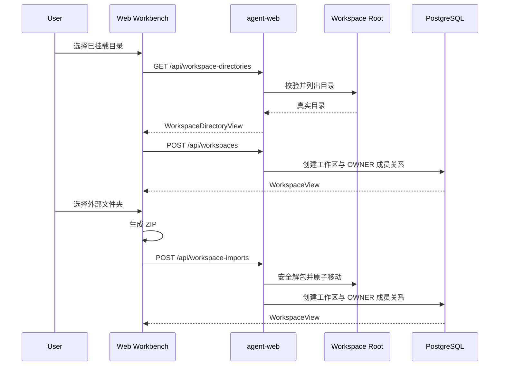

# Agent4J 工作区选择、外部项目导入与真实 Agent 验收设计

## 1. 目标

为本地 Docker 形态的 Agent4J 增加两条明确的项目接入路径：

1. 浏览 `/agent-workspace` 已挂载范围内的目录，选择现有项目并注册为工作区。
2. 从浏览器选择挂载范围外的本地文件夹，将其作为 ZIP 归档上传到受控导入区，安全解包后注册为工作区。

实现完成后，使用真实 LLM 配置在一个隔离的小型 Java 项目上完成一次代码修改、测试执行、最终回答、Trace 和审计日志验收。

## 2. 已有约束

- Compose 使用 `AGENT_CODE_HOST_WORKSPACE` 作为宿主挂载源，并在 Web 容器内映射为 `/agent-workspace`。
- `WorkspaceAccessService` 通过 `Path.toRealPath()` 和 `startsWith(configuredRoot)` 拒绝挂载根外的路径。
- PostgreSQL 中的工作区、成员关系、会话和轮次仍是唯一权威数据源。
- 浏览器不能取得用户所选目录的宿主绝对路径，因此 Web 不能通过一个路径字符串动态扩大 Docker bind mount。
- 外部目录的零复制模式继续由 `agent4j serve --workspace <host-path>` 提供；Web 外部导入采用复制语义。
- 不修改 Planner、Coder、Ops、Reviewer 或 StateGraph 的现有业务路由逻辑。

## 3. 方案比较与选择

### 方案 A：受控目录浏览 + ZIP 导入

- 已挂载项目零复制注册。
- 外部目录由浏览器打包为 ZIP 后上传。
- 后端在固定受控目录中原子解包并注册工作区。
- 能在现有 Docker/Web 架构内完成，不需要重启服务。

采用此方案。

### 方案 B：Web 动态修改 Compose 挂载

- 需要容器控制宿主 Docker Desktop 的路径和 Compose 生命周期。
- 每次切换目录都会重启 Web 服务，中断 SSE、活动轮次和浏览器会话。
- 宿主路径语义依赖操作系统，不满足当前服务端路径门禁模型。

不采用。

### 方案 C：单独桌面桥接进程

- 可以提供原生目录选择和多根挂载。
- 需要新的进程协议、安装器、升级机制和权限模型。
- 适合作为独立桌面产品阶段，不纳入本次范围。

## 4. 后端设计

### 4.1 目录浏览

新增接口：

```text
GET /api/workspace-directories?path=/agent-workspace
```

返回结构：

```json
{
  "currentPath": "/agent-workspace",
  "parentPath": null,
  "entries": [
    {
      "name": "agent-web",
      "path": "/agent-workspace/agent-web"
    }
  ]
}
```

精确规则：

- `path` 为空时使用配置根目录。
- `path` 非空时必须经 `WorkspaceAccessService.validateWorkspacePath` 校验。
- 只返回真实目录，不返回普通文件。
- 目录按 `name` 的自然顺序排序。
- 符号链接解析后的真实路径必须仍位于配置根目录内。
- `parentPath` 在当前目录等于配置根时为 `null`，否则返回校验后的父目录。
- 所有 HTTP 路径统一使用 `/` 分隔符。

### 4.2 外部项目导入

新增接口：

```text
POST /api/workspace-imports
Content-Type: multipart/form-data
```

表单字段：

- `displayName`：工作区名称。
- `repositoryId`：仓库标识。
- `archive`：浏览器生成的 ZIP 文件。

成功返回 `201` 和现有 `WorkspaceView`。导入目标固定为：

```text
<configuredRoot>/.agent4j/imports/<workspaceId>
```

导入过程：

1. 在 `<configuredRoot>/.agent4j/imports/.staging-<workspaceId>` 创建暂存目录。
2. 流式读取 ZIP，逐项校验并写入暂存目录。
3. 全部写入成功后，将暂存目录原子移动为 `<workspaceId>`。
4. 使用现有 `WorkspaceAccessService.create` 注册工作区和 OWNER 成员关系。
5. 数据库注册失败时删除最终导入目录，避免文件系统与 PostgreSQL 双写残留。

### 4.3 安全与容量限制

新增配置：

```properties
agent.workspace-import.max-archive-bytes=${AGENT_WORKSPACE_IMPORT_MAX_ARCHIVE_BYTES:52428800}
agent.workspace-import.max-extracted-bytes=${AGENT_WORKSPACE_IMPORT_MAX_EXTRACTED_BYTES:104857600}
agent.workspace-import.max-files=${AGENT_WORKSPACE_IMPORT_MAX_FILES:5000}
```

后端必须拒绝：

- ZIP 条目绝对路径。
- ZIP 条目经 `normalize()` 后逃离暂存目录。
- ZIP 条目名称为空。
- 文件数超过 `max-files`。
- 上传归档超过 `max-archive-bytes`。
- 解压后累计字节超过 `max-extracted-bytes`。
- 同一归档中重复的规范化目标路径。
- 目标 `<workspaceId>` 已存在。
- 非 ZIP 内容或损坏归档。

失败统一返回 ProblemDetail。容量超限返回 `413 Payload Too Large`，路径和归档格式错误返回 `400 Bad Request`，目标冲突返回 `409 Conflict`。

### 4.4 审计

使用独立 logger `com.agent.audit.workspace` 记录结构化 JSON，日志进入现有控制台与 RollingFileAppender。字段固定为：

- `eventType`
- `userId`
- `workspaceId`
- `workspacePath`
- `displayName`
- `repositoryId`
- `fileCount`
- `archiveBytes`
- `extractedBytes`
- `status`
- `errorType`
- `occurredAt`

事件类型固定为 `WORKSPACE_SELECTED`、`WORKSPACE_IMPORT_COMPLETED`、`WORKSPACE_IMPORT_FAILED`。日志不得包含归档文件内容、模型密钥或环境变量全集。

## 5. Web 交互设计

现有“新建工作区”对话框升级为“添加项目”，使用两个标签页：

### 5.1 选择已挂载项目

- 默认加载 `/agent-workspace`。
- 以紧凑目录列表展示当前目录和子目录。
- 提供返回上级目录按钮；配置根目录不显示可用的返回操作。
- 选中目录后自动填充工作区名称和仓库标识，用户仍可编辑。
- 点击“添加项目”后调用现有工作区创建接口，并切换到新工作区。

### 5.2 导入本地文件夹

- 使用 `input type="file"`、`webkitdirectory` 和 `multiple` 选择文件夹。
- 前端使用 `fflate` 生成 ZIP；ZIP 条目名称来自 `File.webkitRelativePath`。
- 提交前展示文件夹名称、文件数量和原始总字节数。
- 上传期间禁用关闭和重复提交。
- 成功后直接切换到服务端返回的新工作区。
- 失败时在对话框内显示服务端 ProblemDetail 的 `detail`。

界面沿用现有工作台的紧凑工具型视觉语言，不新增营销式说明、装饰卡片或独立落地页。目录按钮使用 Lucide 图标并提供可访问名称。

## 6. 前后端数据流



## 7. 测试策略

### 7.1 单元与控制器测试

- 目录浏览根目录和子目录。
- 拒绝根目录外路径和越界符号链接。
- ZIP 正常导入并注册工作区。
- ZIP Slip、重复路径、损坏 ZIP、文件数和字节数超限。
- 数据库注册失败后的目录回滚。
- REST 返回字段严格匹配。
- Web 标签切换、目录导航、自动填充、ZIP 上传和 ProblemDetail 展示。

### 7.2 Docker 黑盒验收

- Compose 启用 `AGENT_LLM_ENABLED=true` 后 readiness 返回 `200`。
- 目录浏览接口只能看到 `/agent-workspace` 范围。
- Web 导入的小项目被注册并能创建持久化会话。

### 7.3 真实 LLM Agent 验收

受控小项目为 Maven Java 项目，初始包含一个失败测试。任务要求 Agent 修复一个明确的纯函数并运行测试。必须收集：

- 会话和轮次 ID。
- Planner、Coder、Ops、Reviewer Trace 事件。
- LLM 请求日志中的模型名、HTTP 状态、Token 与耗时。
- Coder 产生的文件变更。
- Ops 测试命令、退出码和测试摘要。
- `final_response`。
- `com.agent.audit.conversation` 与 `com.agent.audit.workspace` 的审计记录。

只有真实 API 请求出现在日志中、代码确实改变且项目测试通过，才能报告真实 Agent 验收成功。

## 8. 非目标

- 不允许 Web 直接修改 Compose 文件或 Docker bind mount。
- 不在数据库中保存上传文件内容。
- 不实现 Git 远程仓库克隆。
- 不引入第三方 Agent 框架。
- 不修改现有模型路由与节点业务逻辑。
